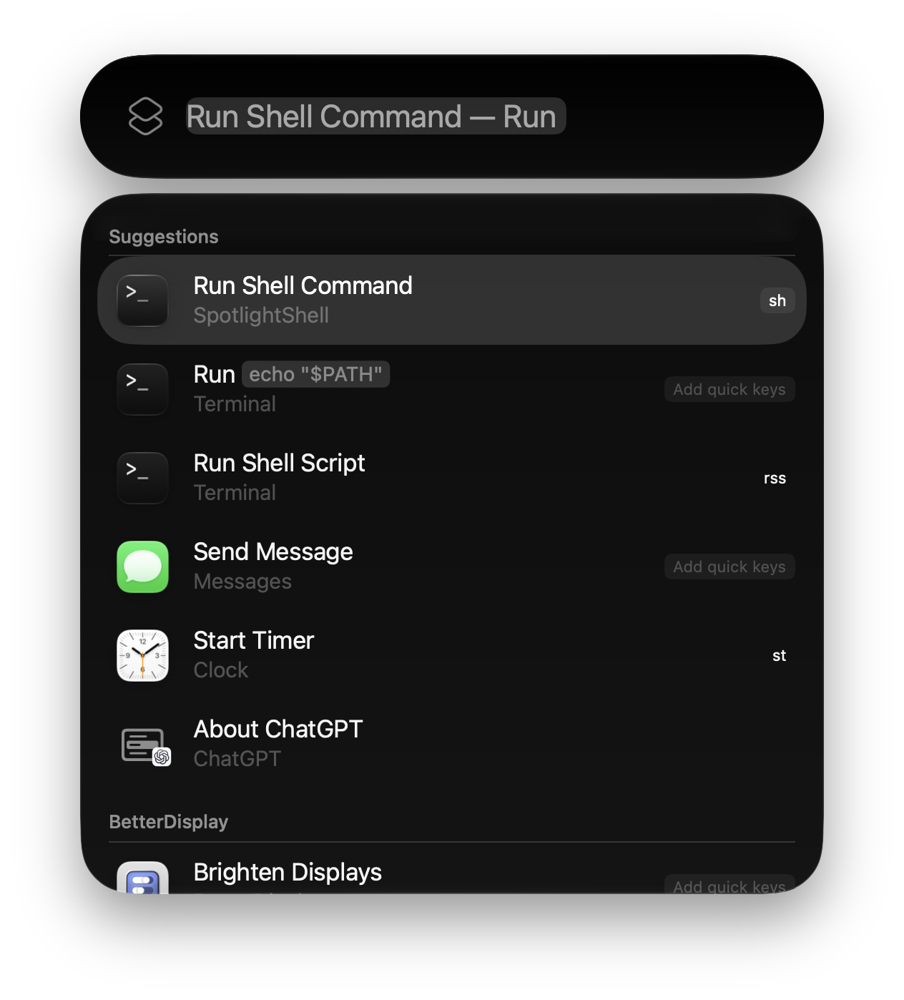
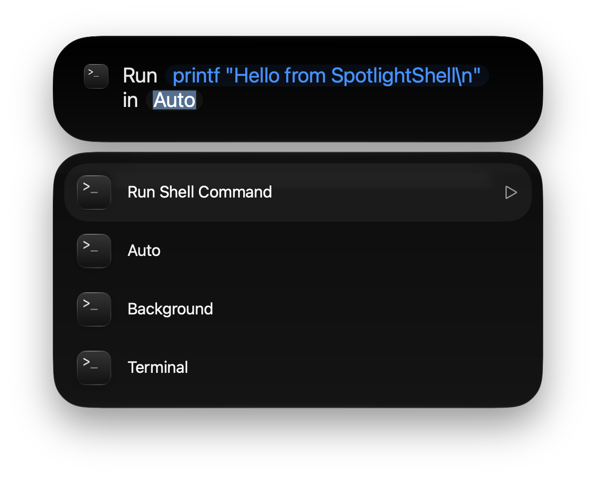
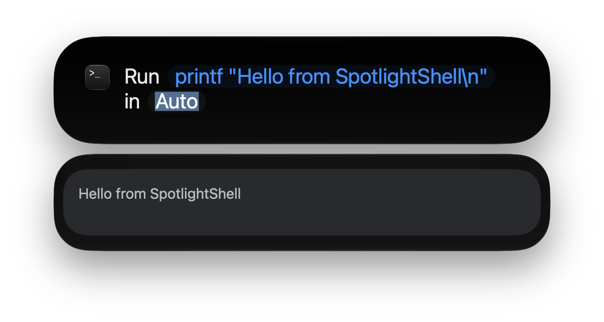

# SpotlightShell

[中文说明](README.zh-Hans.md) · [MIT License](LICENSE)

A small native macOS 26+ app that exposes **Run Shell Command** to Spotlight and Shortcuts. The command is a runtime `String`; there is no command catalog. Swift 6, AppKit, AppIntents, Foundation and Darwin only.







## Build and install

Requires Xcode 26+ with the macOS 26 SDK. Open `SpotlightShell.xcodeproj` and select the shared **SpotlightShell** scheme, or run:

```sh
xcodebuild -project SpotlightShell.xcodeproj -scheme SpotlightShell \
  -configuration Debug -destination 'platform=macOS' \
  -derivedDataPath build build

xcodebuild -project SpotlightShell.xcodeproj -scheme SpotlightShell \
  -configuration Debug -destination 'platform=macOS' \
  -derivedDataPath build test
```

The app is `build/Build/Products/Debug/SpotlightShell.app`. On another Mac, select your own signing team/identity in Signing & Capabilities. Ad-hoc signing can compile the app but may not reliably refresh its runtime App Shortcut; use a real Apple development signature for Spotlight testing. Tests are an unhosted XCTest bundle that compile the same execution sources; they do not send Apple Events, launch Terminal, or change privacy settings.

To install without replacing an existing app:

```sh
mkdir -p "$HOME/Applications"
if [ ! -e "$HOME/Applications/SpotlightShell.app" ]; then
  ditto build/Build/Products/Debug/SpotlightShell.app "$HOME/Applications/SpotlightShell.app"
  open "$HOME/Applications/SpotlightShell.app"
else
  printf '%s\n' 'SpotlightShell.app already exists; inspect it before replacing it.'
fi
```

Opening SpotlightShell from its application icon presents the standard macOS **About SpotlightShell** panel. It displays the icon, name and version from `Info.plist`, with centered links to the author’s website and this repository.

## Spotlight setup and interactive verification

1. Install and open the app once. Allow macOS time to discover it.
2. Press **Command-Space**, then **Command-3** to filter to Actions.
3. Search for **Run Shell Command** (or **SpotlightShell**) and select the SpotlightShell action.
4. Enter `printf "hello\n"` in **Command**, keep **Run Mode** at **Auto**, then choose the **Run Shell Command** row (or its play button) to submit. The report should show exit status 0 and `hello` under stdout.
5. Run `pwd`, then `echo "$SHELL"`; expect `/bin/zsh`.
6. Try `printf 'example error\n' >&2; exit 7`. The result must include stderr and exit status 7.
7. Select **Terminal** explicitly. Run `printf "hello\n"; tty`, then test an interactive program such as `top` (quit with `q`). macOS may ask to let SpotlightShell control Terminal. Approve only if you want Terminal mode.
8. Wait for SpotlightShell to exit, then repeat a Background action to check cold launch. Terminal remains open independently after handoff.

In Shortcuts the same action returns a Text report that can feed **Show Result**. The screenshots above show discovery, the run-mode picker, and output from `printf "Hello from SpotlightShell\\n"`.

To assign `sh`, find the action and click **Add quick keys** beside it, type `sh`, then confirm. If a key is already assigned, edit its field. Invoke with Command-Space, type `sh`, fill the command field and press Return. Quick Keys belong to the user's Spotlight configuration; SpotlightShell never sets them. Apple documents Actions, filling parameters, and assigning Quick Keys in [Take actions and shortcuts in Spotlight](https://support.apple.com/guide/mac-help/mchl4953dfeb/mac).

If the action is missing, first check Shortcuts → Apps → SpotlightShell and reopen the installed app. Check your Spotlight Actions visibility manually if needed. Do not use database resets or change global Spotlight settings as part of installation. Avoid retaining multiple installed builds with the same bundle identifier.

## Architecture

| File | Responsibility |
| --- | --- |
| `RunShellCommandIntent.swift` | Runtime parameters, `AppEnum`, `AppShortcutsProvider`, result/dialog |
| `SpotlightShellApp.swift` | Windowless AppKit entry point and registration refresh |
| `AppLifetime.swift` | Counts active actions and terminates after inactivity |
| `ShellRequest.swift` | Input/path validation and login environment |
| `BackgroundRunner.swift` | Spawn, concurrent pipe draining, timeout, cancellation and cleanup |
| `CommandResult.swift` | Text report, status and visible truncation notices |
| `TerminalRunner.swift` | Shell argument quoting and typed Apple Event handoff |
| `SpotlightShellTests/ShellTests.swift` | Harmless execution and quoting regression tests |

### Background

Executes `/bin/zsh` with separate arguments `-lc` and the exact command. The working directory is a `posix_spawn_file_actions_addchdir` action, never shell source. An omitted/empty directory means the home folder. Accepted explicit paths are absolute paths, `~`, and `~/…`; other relative paths, NULs, missing folders and non-folders are rejected. No `$VARIABLE` expansion or shell quoting is applied to the directory field: enter its actual filesystem path, without surrounding quotes.

The app inherits its launch environment, fills in user identity, preserves an inherited PATH verbatim (or supplies only system directories if PATH is absent), then lets login zsh read its normal login startup files. Homebrew setup comes from those files; the app does not append Homebrew directories itself. `.zshrc` is not loaded in Background, so interactive aliases/functions or PATH changes defined only there may be unavailable. A user's startup files can still alter PATH, output or directory. No global shell files are modified.

Stdin is `/dev/null`; stdout and stderr are separate nonblocking pipes. Each stream retains at most 64 KiB, continues draining excess output to avoid deadlock, and explicitly reports truncation. Bytes are decoded as UTF-8 with replacement for invalid sequences. The action returns a Text report with stdout, stderr, numeric exit status and signal where applicable. Its dialog is capped at 3,000 characters; a shortened dialog points to the fuller Text result. Spotlight may further shorten or suppress presentation.

Background is intended for short noninteractive commands. The 20-second limit is measured using a monotonic clock. Timeout and task cancellation send TERM, allow 0.2 seconds for cleanup, then KILL the command's process group. The leader is kept unreaped until cleanup to avoid PID reuse. Ordinary background children are also stopped after their shell exits. There is no mode guessing: commands needing stdin or a TTY should be run in Terminal. An EOF-reading command can exit successfully without producing output; the app cannot infer whether that was intended.

Nonzero command status is returned as data with a visible error report, rather than throwing away its stdout/stderr. A Shortcuts workflow must inspect that status text if it needs to branch on failure. Validation, launch, transport and cancellation errors throw instead.

### Terminal

Opens Apple Terminal and sends its documented `core` / `dosc` (do script) Apple Event. The entire script is an `NSAppleEventDescriptor(string:)` direct parameter, never interpolated AppleScript source. Omitting a target tab asks Terminal to create a fresh window, protecting existing sessions.

The payload is `cd -- <quoted-directory> && /bin/zsh -lic <quoted-command>`. POSIX single-quote encoding preserves spaces, quotes, `$`, backticks, Unicode and newlines. The exact command is passed as one zsh argument. Failure to change directories prevents **all** of the user's command from running. The inner zsh is interactive and a login shell, so programs receive Terminal's TTY and normal `.zshrc` setup. After the command finishes, the surrounding Terminal shell remains available; `echo $?` inspects the nested shell's status.

The outer Terminal profile must use a POSIX-compatible shell such as zsh or bash. Custom non-POSIX profile commands are outside this version's scope. Login startup files may change directories here too. Terminal success means the command was handed off, not that it completed successfully; output and errors stay in Terminal. A transport timeout explicitly warns to check Terminal before retrying to avoid running a command twice.

## Privacy, permissions and signing

- No analytics, command uploads, networking code, command database, logs of commands, or persisted command files. Commands and output live in memory. The app does not donate executed commands for suggestions.
- macOS Spotlight/Shortcuts may retain searches, results or saved shortcut parameters. Terminal, shell history, session restoration and invoked programs may retain commands or output according to their existing settings. Normal process arguments can also be visible to local process inspection. SpotlightShell does not change those settings or promise system-wide erasure.
- App Sandbox is **off**: a sandboxed subprocess inherits restrictions and cannot provide arbitrary user-level shell access. This is a direct-distribution utility, not a sandboxed Mac App Store app. It runs as the current user, never root. User-entered commands can perform whatever that account can do; this runner is not a security boundary.
- The sole explicitly requested app entitlement is `com.apple.security.automation.apple-events`. `NSAppleEventsUsageDescription` explains Terminal access. Terminal mode may request Automation consent; Background mode does not need it. No Accessibility, Full Disk Access, admin, microphone, camera, or network permission is pre-requested. OS-protected files remain subject to TCC; commands may fail when access is denied.
- The intent requires local-device authentication through the SDK's `requiresLocalDeviceAuthentication` policy. macOS owns the authentication UI.
- Hardened Runtime is enabled. Debug builds may also receive Xcode’s standard get-task-allow entitlement; Release builds do not request it. Xcode disables Hardened Runtime if you override signing to ad-hoc. For distribution, select your Apple Development/Developer ID signing identity and team, preserve the Automation entitlement, archive, sign and notarize normally. Ad-hoc builds are only for local testing, not notarized releases. Rebuilding with ad-hoc signing may cause macOS to treat Automation consent differently.
- Process-group cleanup contains ordinary descendants, not programs deliberately creating a new session or daemonizing. No privileged service is installed to police arbitrary descendants. Terminal and programs explicitly launched by the user can outlive SpotlightShell. The app itself has no persistent background process.

## SDK investigation and limits

Implemented against Xcode 26.2 (17C52), SDK macOS 26.2; deployment target macOS 26.0. Before implementation, the installed `AppIntents.swiftinterface` was inspected for `AppIntent`, `IntentParameter<String>`, `IntentParameterSummary`, `AppEnum`, `AppShortcutsProvider`, `AppShortcut`, `IntentModes`, string input options and authentication policy. Foundation's `NSAppleEventDescriptor.h`, Darwin's `spawn.h`, and Terminal's installed `Terminal.sdef` supplied the process/Apple Event interfaces.

The implementation uses `supportedModes = .background`, replacing deprecated `openAppWhenRun`. This keeps **SpotlightShell** in the background even when the user chooses to open **Terminal**. These are different concepts. The provider's phrase includes the required application-name placeholder; free-form command text belongs in the intent parameter, not in a predefined App Shortcut phrase parameter.

Apple's [WWDC25 Spotlight/App Intents session](https://developer.apple.com/videos/play/wwdc2025/260/) explains that required parameters without defaults must appear in the parameter summary and the intent must remain discoverable. This project follows that contract. There is no public API used to force Spotlight indexing, assign a Quick Key, supply a custom Spotlight text editor or guarantee an output dialog's display. Those system-owned behaviors must be checked on the installed OS.
